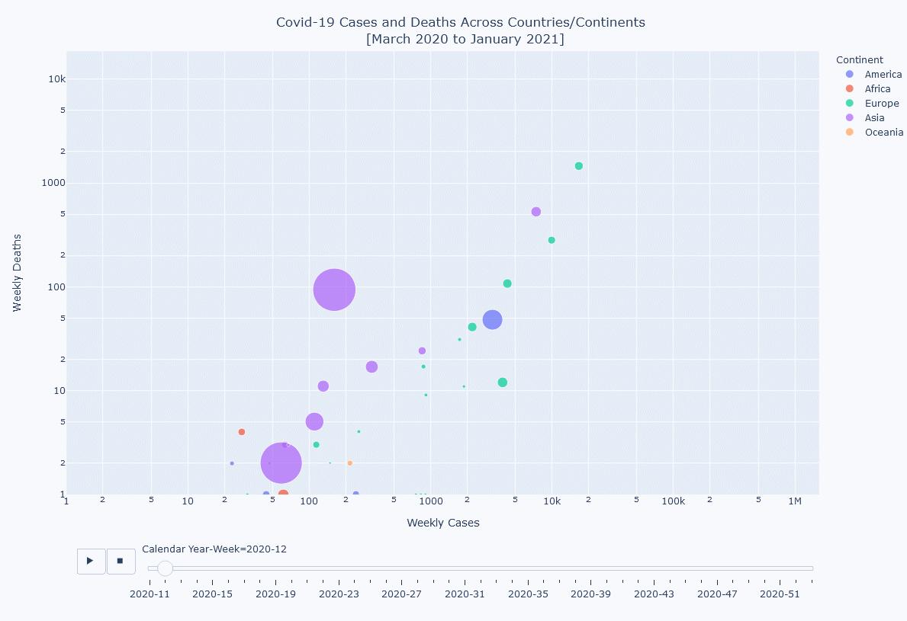

## Covid-19 Analysis

### Weekly new cases/deaths

The below animation shows the development of the death rate (weekly deaths over the total population) relative to the development of the new case rate (weekly new cases over the total population) for four major European Countries for October to December 2020 (including the beginning of January 2021).
 

 
 

A <strong> click on the image below </strong> opens an interactive Plotly Bubble Plot that provides country-level information on the average cases and deaths from the start of the pandemic up to the first days of Janaury 2021:

 

 
 

### Country-Level information on total cases and deaths [up to January 2020]

A <strong> click on the image below </strong> opens an interactive Folium Map that provides country-level information on the total cases and deaths from the start of the pandemic up to the first days of Janaury 2021: 

 
 

### Country-Region-Level information on new cases in preceding 14 day window as of January 3, 2021

A <strong> click on the image below </strong> opens an interactive Folium Map that provides country-region-level information on the new cases per 100,000 inhabitants during the past 14 days as of January 3, 2021:

 

 
 
 

---

The underlying data is available at https://www.ecdc.europa.eu/en/publications-data/download-todays-data-geographic-distribution-covid-19-cases-worldwide and https://www.ecdc.europa.eu/en/publications-data/subnational-14-day-notification-rate-covid-19

The underlying code of all plots presented above is partly based on modified code snippets from Spiced Academy. Moreover, for the generation of the above Folium Maps, the code provided on this website was used as a starting point: https://towardsdatascience.com/using-python-to-create-a-world-map-from-a-list-of-country-names-cd7480d03b10
